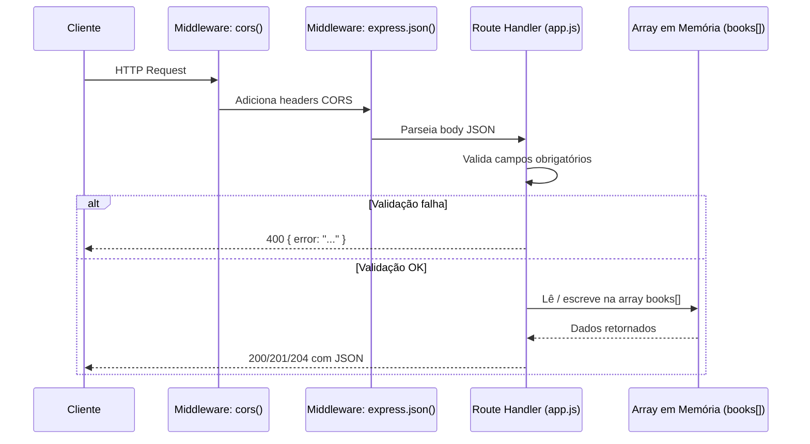
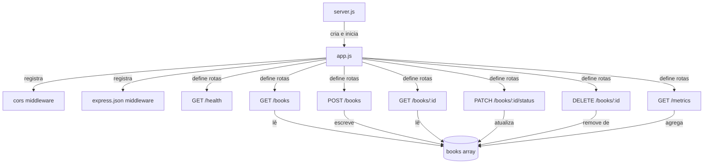
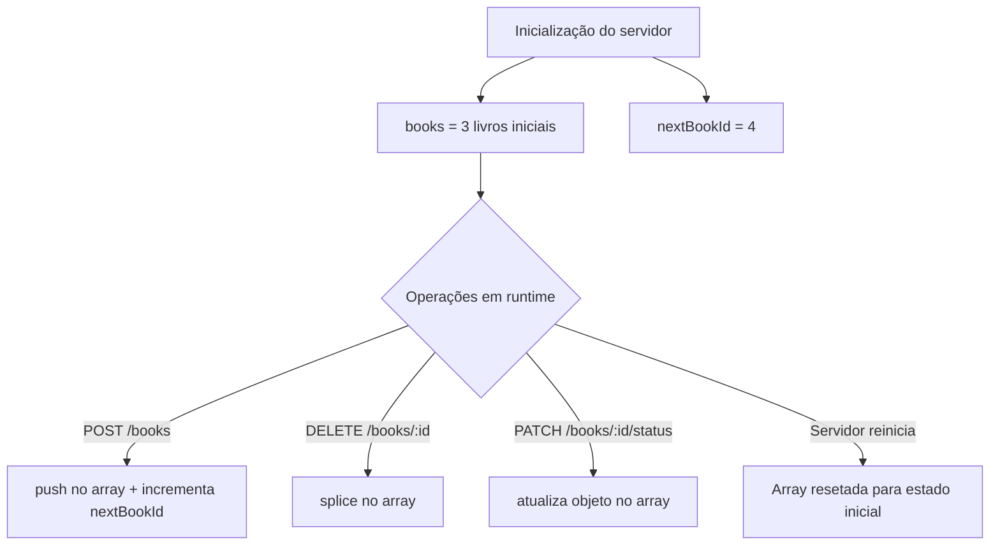
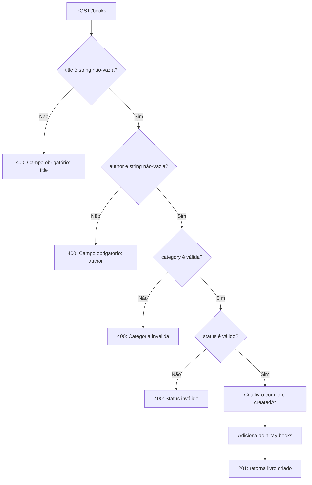
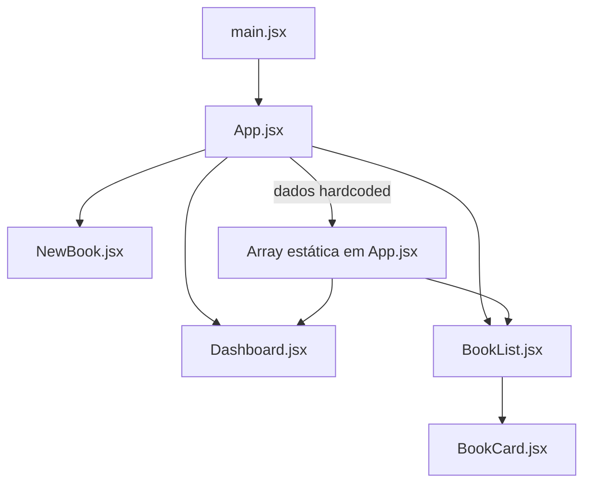
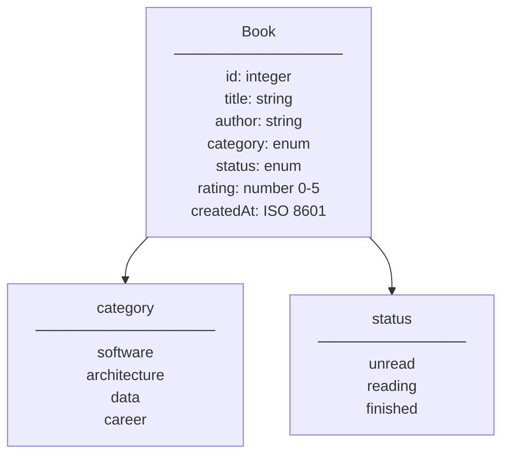

# Arquitetura — Bookshelf API

Documentação da estrutura arquitetural do projeto `bookshelf-api`.

---

## Visão Geral

O projeto é composto por dois serviços independentes:

- **Backend**: API REST Express.js (monolítica, in-memory)
- **Frontend**: SPA React com dados hardcoded (sem integração real com o backend)

---

## Fluxo de Requisição HTTP

Cada requisição ao backend percorre o seguinte caminho dentro de `backend/src/app.js`:

---

## Estrutura de Módulos do Backend

---

## Armazenamento de Dados

Não há banco de dados. Os dados vivem em uma array JavaScript declarada em `app.js`:

> Os dados não são persistidos. Reiniciar o servidor restaura os 3 livros de exemplo.

---

## Fluxo de Validação (POST /books)

---

## Estrutura do Frontend

> O frontend não faz chamadas HTTP ao backend. Os dados são uma array estática definida dentro de `App.jsx`.

---

## Entidade Principal: Book

---

## Decisões Arquiteturais Notáveis

| Decisão | Detalhe |
|---|---|
| Monólito sem camadas | Todo o código de rota, validação e lógica está em `app.js` |
| In-memory storage | Simplicidade para fins didáticos; sem persistência |
| CORS aberto | `cors()` sem restrição de origem — adequado para desenvolvimento |
| Sem autenticação | Todos os endpoints são públicos |
| Frontend desacoplado | O frontend não integra com a API neste momento |
