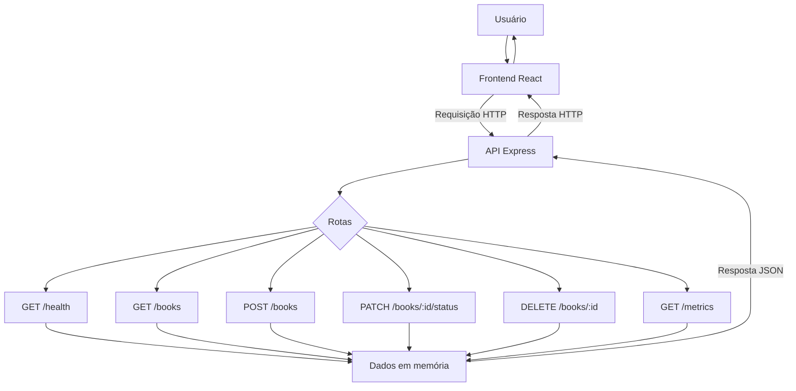
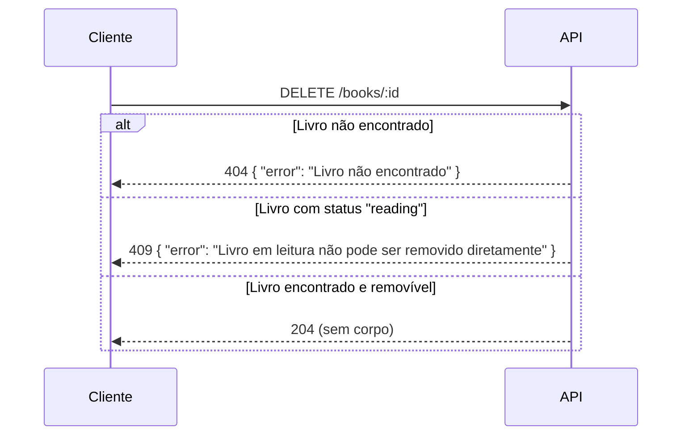

# Fluxo da Aplicação

```mermaid
flowchart TD
    A[Usuário] --> B[Frontend React]
    B -->|Requisição HTTP| C[API Express]
    C --> D{Rotas}
    D --> E[GET /health]
    D --> F[GET /books]
    D --> G[POST /books]
    D --> H[PATCH /books/:id/status]
    D --> I[DELETE /books/:id]
    D --> J[GET /metrics]
    E --> K[Dados em memória]
    F --> K
    G --> K
    H --> K
    I --> K
    J --> K
    K -->|Resposta JSON| C
    C -->|Resposta HTTP| B
    B --> A
```

## DELETE /books/:id

```mermaid
sequenceDiagram
    participant Cliente
    participant API

    Cliente->>API: DELETE /books/:id

    alt Livro não encontrado
        API-->>Cliente: 404 { "error": "Livro não encontrado" }
    else Livro com status "reading"
        API-->>Cliente: 409 { "error": "Livro em leitura não pode ser removido diretamente" }
    else Livro encontrado e removível
        API-->>Cliente: 204 (sem corpo)
    end
```
