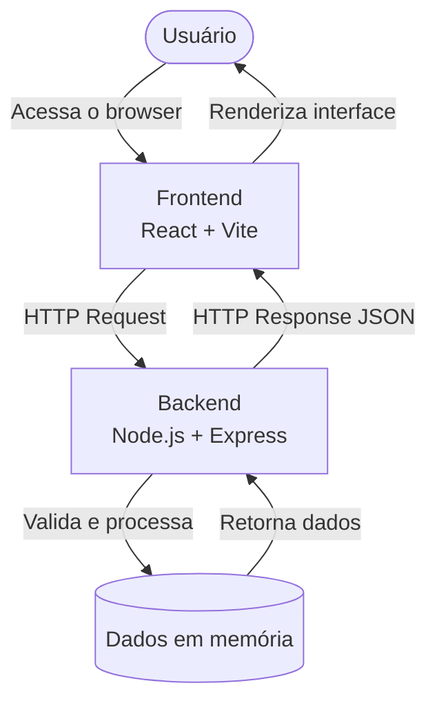
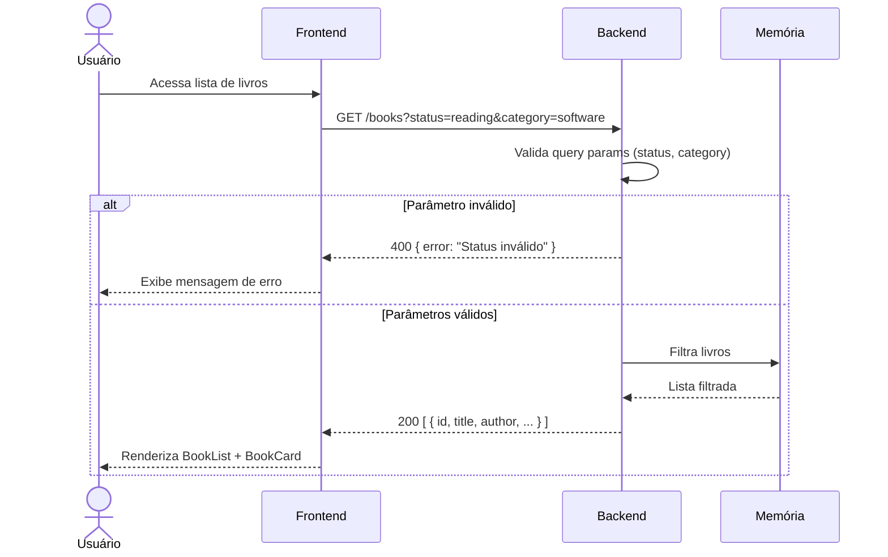
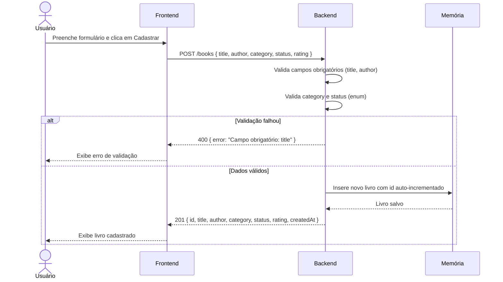
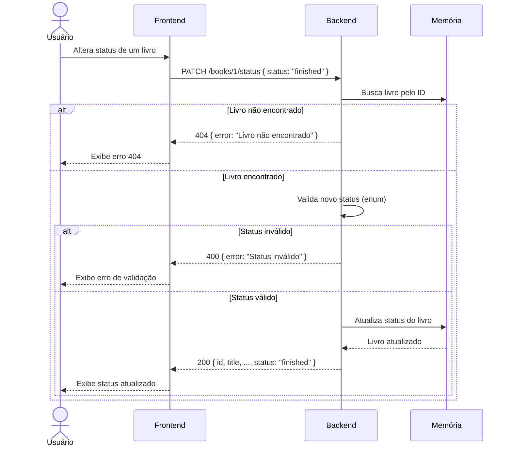
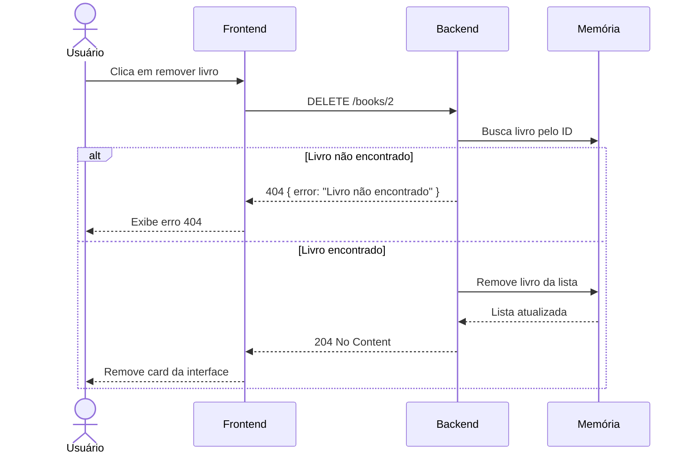
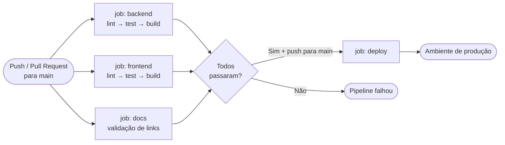
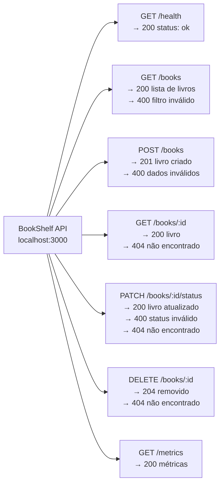

# Fluxo da aplicação

Diagramas Mermaid representando os principais fluxos entre usuário, frontend, backend e respostas da API.

## Fluxo geral da aplicação

## Fluxo de requisição — GET /books

## Fluxo de requisição — POST /books

## Fluxo de requisição — PATCH /books/:id/status

## Fluxo de requisição — DELETE /books/:id

## Fluxo do pipeline CI/CD

## Mapa de endpoints

