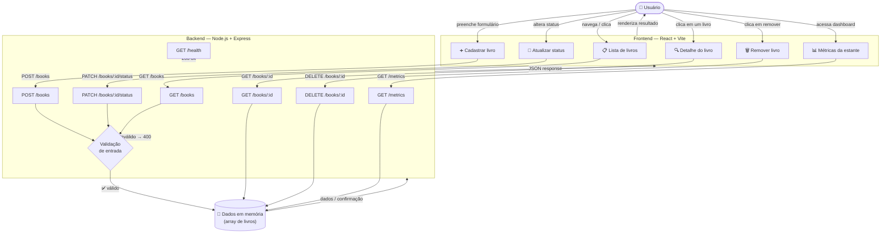

# Fluxo da aplicação

```mermaid
flowchart TD
    U([👤 Usuário])

    subgraph FE["Frontend — React + Vite"]
        FE_LIST["📋 Lista de livros"]
        FE_DETAIL["🔍 Detalhe do livro"]
        FE_NEW["➕ Cadastrar livro"]
        FE_STATUS["🔄 Atualizar status"]
        FE_DELETE["🗑️ Remover livro"]
        FE_METRICS["📊 Métricas da estante"]
    end

    subgraph API["Backend — Node.js + Express"]
        R_HEALTH["GET /health"]
        R_LIST["GET /books"]
        R_GET["GET /books/:id"]
        R_POST["POST /books"]
        R_PATCH["PATCH /books/:id/status"]
        R_DELETE["DELETE /books/:id"]
        R_METRICS["GET /metrics"]

        VALIDATE{"Validação\nde entrada"}
    end

    MEM[("💾 Dados em memória\n(array de livros)")]

    %% Usuário interage com o frontend
    U -->|"navega / clica"| FE_LIST
    U -->|"clica em um livro"| FE_DETAIL
    U -->|"preenche formulário"| FE_NEW
    U -->|"altera status"| FE_STATUS
    U -->|"clica em remover"| FE_DELETE
    U -->|"acessa dashboard"| FE_METRICS

    %% Frontend chama a API
    FE_LIST  -->|"GET /books"| R_LIST
    FE_DETAIL -->|"GET /books/:id"| R_GET
    FE_NEW   -->|"POST /books"| R_POST
    FE_STATUS -->|"PATCH /books/:id/status"| R_PATCH
    FE_DELETE -->|"DELETE /books/:id"| R_DELETE
    FE_METRICS -->|"GET /metrics"| R_METRICS

    %% Rotas que validam entrada passam pelo bloco de validação
    R_POST  --> VALIDATE
    R_PATCH --> VALIDATE
    R_LIST  --> VALIDATE

    %% Validação bem-sucedida acessa memória
    VALIDATE -->|"✅ válido"| MEM
    VALIDATE -->|"❌ inválido → 400"| API

    %% Rotas sem validação acessam memória diretamente
    R_GET    --> MEM
    R_DELETE --> MEM
    R_METRICS --> MEM
    R_HEALTH -->|"200 ok"| API

    %% Memória retorna dados para a API
    MEM -->|"dados / confirmação"| API

    %% API responde ao frontend
    API -->|"JSON response"| FE

    %% Frontend atualiza a tela
    FE -->|"renderiza resultado"| U
```
