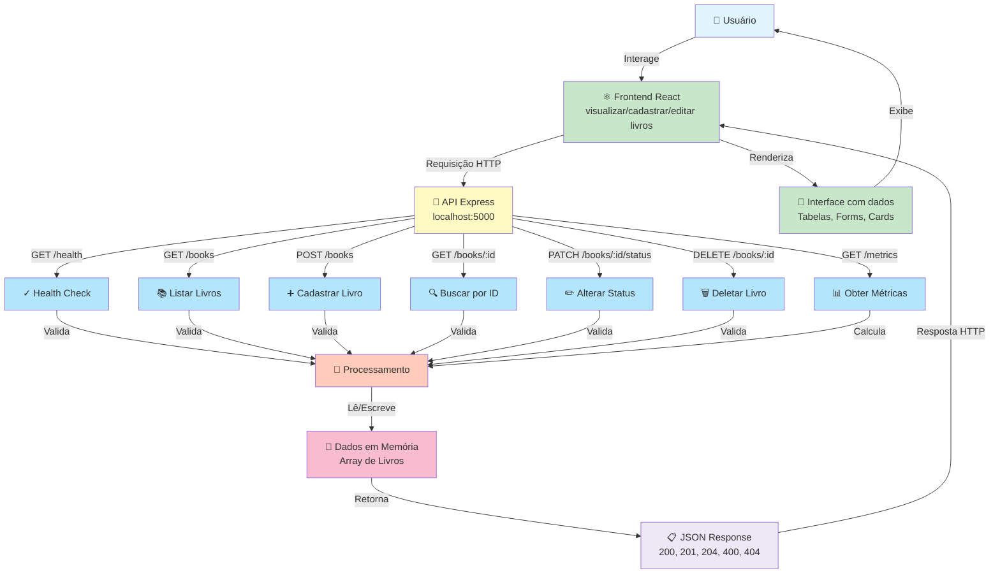

# 🔄 Fluxo da Aplicação BookShelf-API

## Diagrama do Fluxo Completo

## Resumo do Fluxo

1. **Usuário** interage com o Frontend React
2. **Frontend** envia requisição HTTP para a API Express em localhost:5000
3. **API** processa 7 rotas diferentes (Health, Listar, Criar, Buscar, Atualizar, Deletar, Métricas)
4. **Processamento** valida os dados
5. **Dados em Memória** (Array) é lido/escrito
6. **Resposta JSON** retorna ao Frontend com status HTTP apropriado
7. **Interface React** renderiza os dados
8. **Usuário** visualiza a tela atualizada

## Características

- ✅ Sem banco de dados externo
- ✅ Sem autenticação
- ✅ Sem serviços externos
- ✅ Dados persistem apenas durante a execução
- ✅ Todas as 7 rotas da API representadas
- ✅ Validações e tratamento de erros inclusos

---

**Nota:** Para mais detalhes sobre casos de uso específicos, consulte [casos-uso.md](casos-uso.md)
