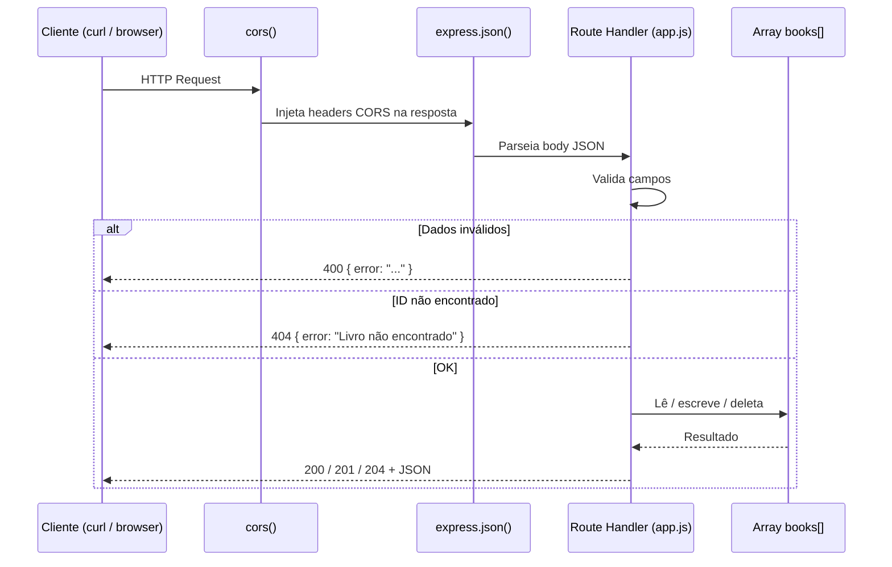
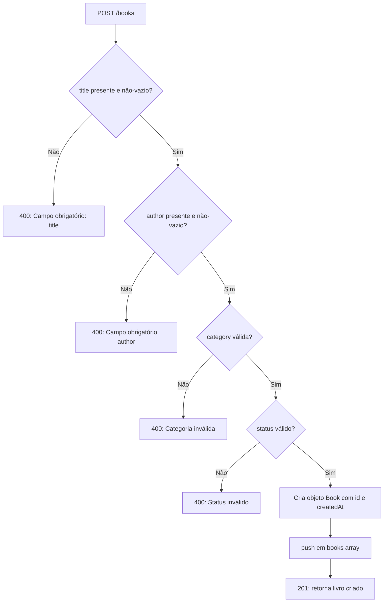
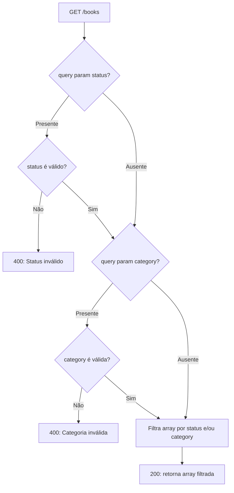
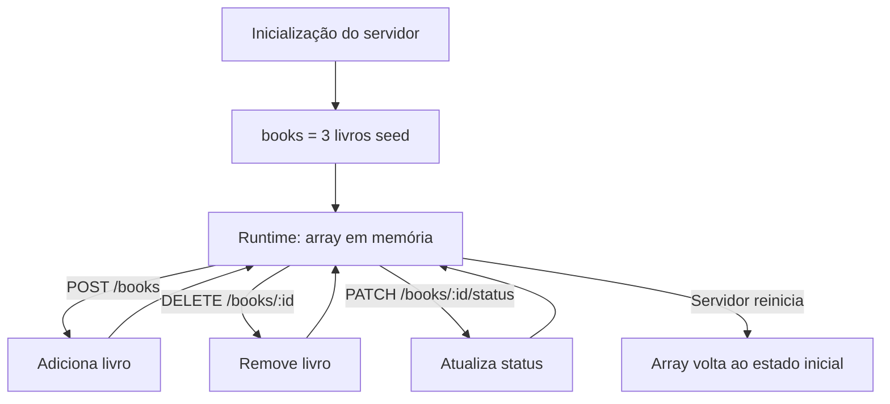

# Fluxo da Aplicação — Bookshelf API

Diagrama de fluxo completo de uma requisição HTTP ao backend.

---

## Fluxo Geral de Requisição

---

## Fluxo de Criação de Livro (POST /books)

---

## Fluxo de Listagem com Filtros (GET /books)

---

## Ciclo de Vida dos Dados

