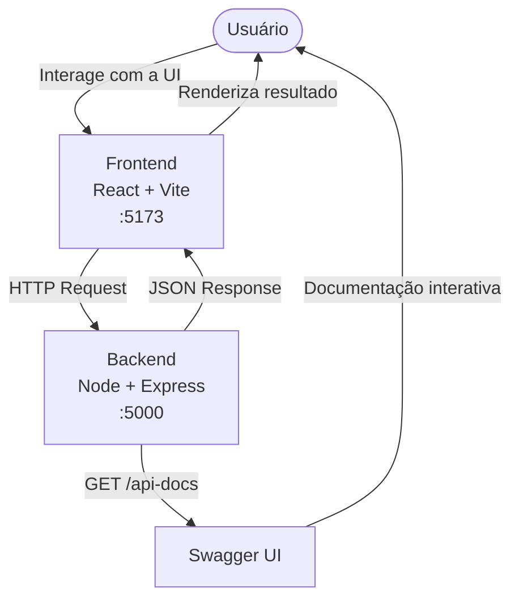
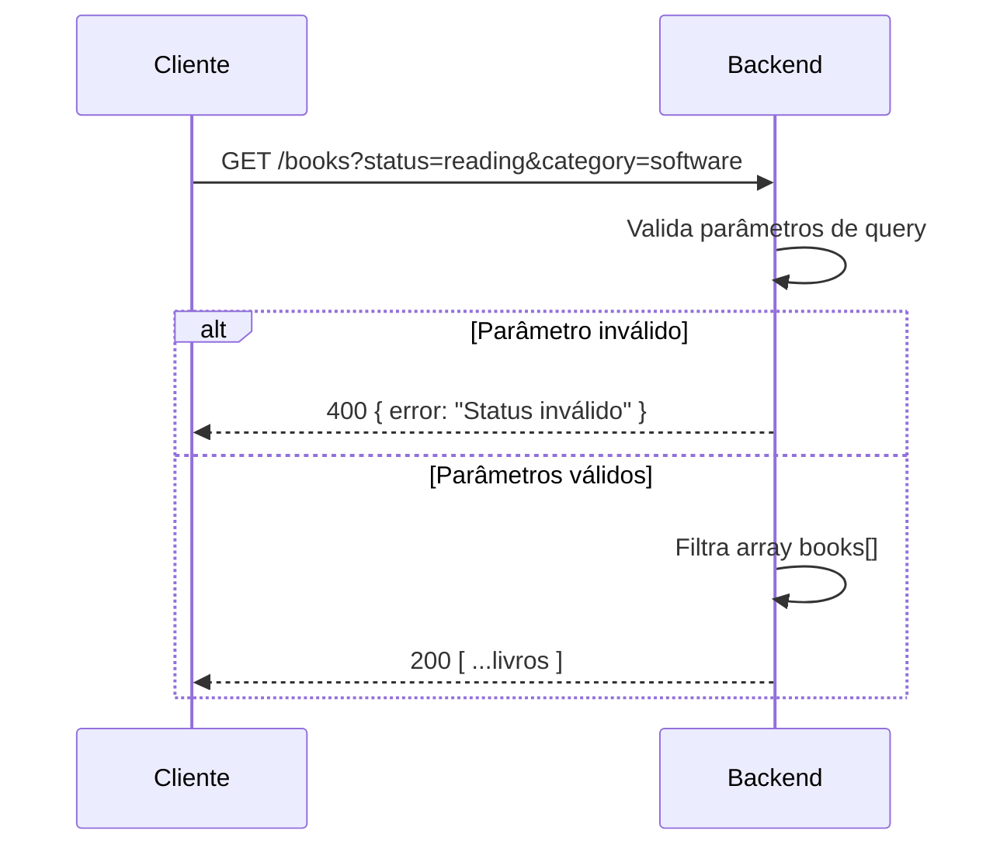
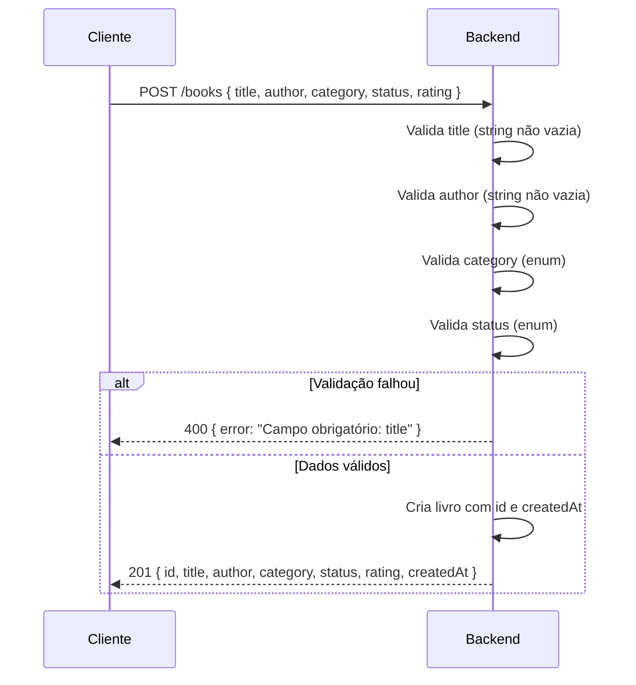
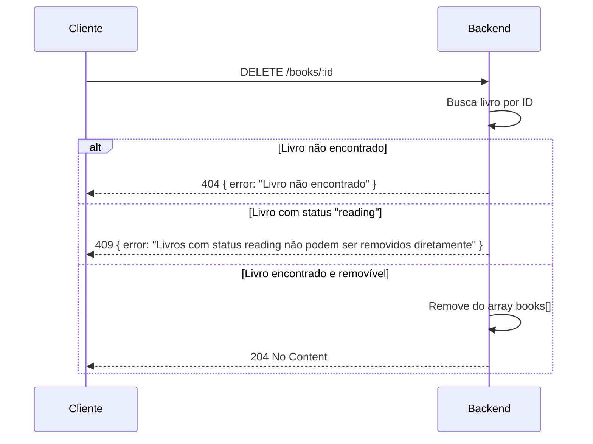
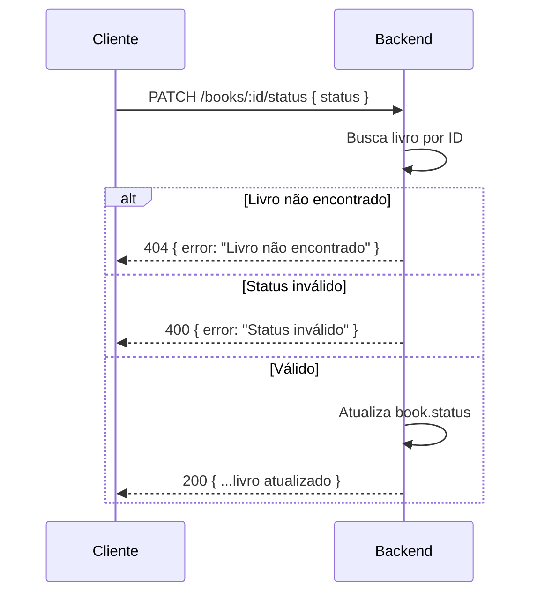
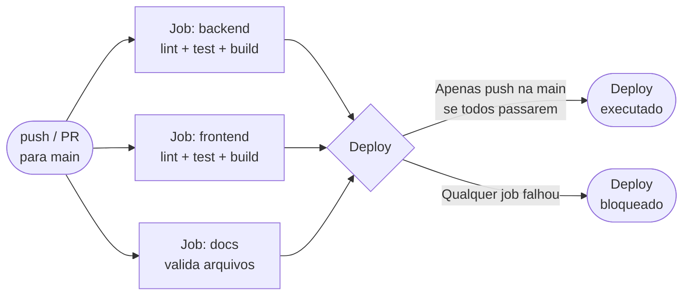

# Fluxo da aplicação — BookShelf API

## Fluxo geral entre usuário, frontend e backend

## Fluxo detalhado por operação

### Listar livros — GET /books

### Criar livro — POST /books

### Remover livro — DELETE /books/:id

### Atualizar status — PATCH /books/:id/status

## Fluxo do pipeline CI/CD

