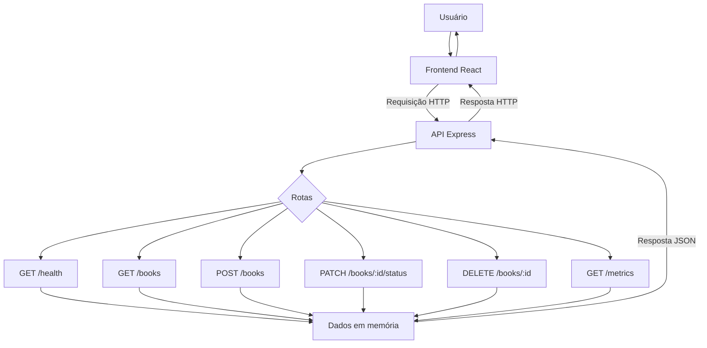
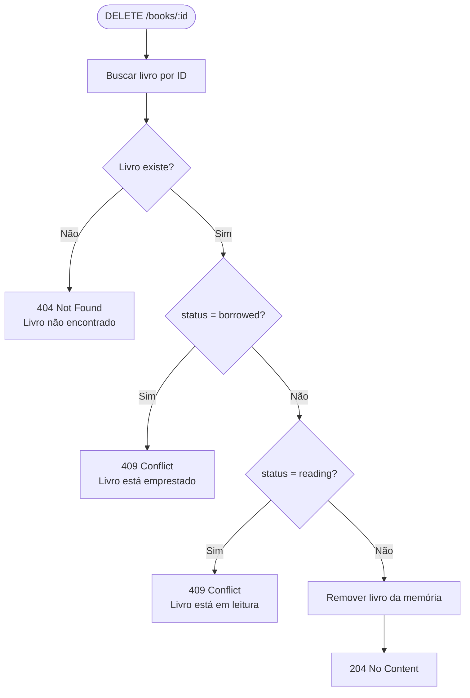

# Fluxo da Aplicação

```mermaid
flowchart TD
    A[Usuário] --> B[Frontend React]
    B -->|Requisição HTTP| C[API Express]
    C --> D{Rotas}
    D --> E[GET /health]
    D --> F[GET /books]
    D --> G[POST /books]
    D --> H[PATCH /books/:id/status]
    D --> I[DELETE /books/:id]
    D --> J[GET /metrics]
    E --> K[Dados em memória]
    F --> K
    G --> K
    H --> K
    I --> K
    J --> K
    K -->|Resposta JSON| C
    C -->|Resposta HTTP| B
    B --> A
```

## Fluxo detalhado — DELETE /books/:id

```mermaid
flowchart TD
    Start([DELETE /books/:id]) --> FindBook[Buscar livro por ID]
    FindBook --> BookExists{Livro existe?}
    BookExists -- Não --> R404[404 Not Found\nLivro não encontrado]
    BookExists -- Sim --> CheckBorrowed{status = borrowed?}
    CheckBorrowed -- Sim --> R409B[409 Conflict\nLivro está emprestado]
    CheckBorrowed -- Não --> CheckReading{status = reading?}
    CheckReading -- Sim --> R409R[409 Conflict\nLivro está em leitura]
    CheckReading -- Não --> Delete[Remover livro da memória]
    Delete --> R204[204 No Content]
```
