# Diagrama de Fluxo da Aplicação - BookShelf API

## Visão Geral

Este diagrama representa o fluxo completo da aplicação BookShelf, mostrando a interação entre o usuário, frontend React, API Express e armazenamento em memória.

---

## Diagrama de Fluxo

```mermaid
flowchart TD
    Usuario["👤 Usuário"]
    
    subgraph Frontend["🖥️ Frontend React"]
        UI["Interface de Usuário"]
        FormCadastro["Formulário de Cadastro"]
        ListaLivros["Lista de Livros"]
        Filtros["Filtros e Busca"]
        Metricas["Visualização de Métricas"]
    end
    
    subgraph API["🔧 API Express"]
        Health["GET /health"]
        ListBooks["GET /books"]
        CreateBook["POST /books"]
        GetBook["GET /books/:id"]
        UpdateStatus["PATCH /books/:id/status"]
        DeleteBook["DELETE /books/:id"]
        MetricsRoute["GET /metrics"]
    end
    
    subgraph Dados["💾 Dados em Memória"]
        BooksArray["Array de Livros"]
        NextId["Contador de IDs"]
    end
    
    Usuario -->|Acessa| UI
    
    UI -->|Visualizar| ListaLivros
    UI -->|Cadastrar| FormCadastro
    UI -->|Filtrar| Filtros
    UI -->|Consultar| Metricas
    
    ListaLivros -->|GET /books| ListBooks
    ListBooks -->|Lê| BooksArray
    BooksArray -->|Retorna lista| ListBooks
    ListBooks -->|JSON 200| ListaLivros
    
    FormCadastro -->|POST /books| CreateBook
    CreateBook -->|Valida dados| CreateBook
    CreateBook -->|Gera ID| NextId
    NextId -->|Incrementa| NextId
    CreateBook -->|Salva| BooksArray
    BooksArray -->|Confirma| CreateBook
    CreateBook -->|JSON 201| FormCadastro
    FormCadastro -->|Atualiza| ListaLivros
    
    Filtros -->|GET /books?status=X| ListBooks
    Filtros -->|GET /books?category=X| ListBooks
    ListBooks -->|Filtra| BooksArray
    BooksArray -->|Retorna filtrado| ListBooks
    ListBooks -->|JSON 200| Filtros
    
    ListaLivros -->|GET /books/:id| GetBook
    GetBook -->|Busca| BooksArray
    BooksArray -->|Retorna livro| GetBook
    GetBook -->|JSON 200| ListaLivros
    
    ListaLivros -->|PATCH /books/:id/status| UpdateStatus
    UpdateStatus -->|Busca| BooksArray
    BooksArray -->|Encontra livro| UpdateStatus
    UpdateStatus -->|Atualiza status| BooksArray
    BooksArray -->|Confirma| UpdateStatus
    UpdateStatus -->|JSON 200| ListaLivros
    ListaLivros -->|Atualiza| UI
    
    ListaLivros -->|DELETE /books/:id| DeleteBook
    DeleteBook -->|Busca| BooksArray
    BooksArray -->|Encontra livro| DeleteBook
    DeleteBook -->|Remove| BooksArray
    BooksArray -->|Confirma| DeleteBook
    DeleteBook -->|204 No Content| ListaLivros
    ListaLivros -->|Atualiza| UI
    
    Metricas -->|GET /metrics| MetricsRoute
    MetricsRoute -->|Calcula| BooksArray
    BooksArray -->|Fornece dados| MetricsRoute
    MetricsRoute -->|JSON 200| Metricas
    Metricas -->|Exibe| UI
    
    UI -->|Verifica saúde| Health
    Health -->|Retorna status| UI
    
    style Usuario fill:#e1f5ff
    style Frontend fill:#f3e5f5
    style API fill:#fff3e0
    style Dados fill:#e8f5e9
    style UI fill:#f3e5f5
    style BooksArray fill:#c8e6c9
    style NextId fill:#c8e6c9
```



---

## Fluxo de Operações

### 1. **Visualizar Livros**
```
Usuário → Frontend (ListaLivros) → GET /books → API (ListBooks) → Dados (BooksArray) → JSON 200 → Frontend → Usuário
```

### 2. **Cadastrar Livro**
```
Usuário → Frontend (FormCadastro) → POST /books → API (CreateBook) → Valida → Gera ID → Salva em Dados → JSON 201 → Frontend → Atualiza ListaLivros → Usuário
```

### 3. **Filtrar Livros**
```
Usuário → Frontend (Filtros) → GET /books?status=X ou ?category=X → API (ListBooks) → Filtra Dados → JSON 200 → Frontend → Usuário
```

### 4. **Buscar Livro por ID**
```
Usuário → Frontend (ListaLivros) → GET /books/:id → API (GetBook) → Busca em Dados → JSON 200 → Frontend → Usuário
```

### 5. **Atualizar Status**
```
Usuário → Frontend (ListaLivros) → PATCH /books/:id/status → API (UpdateStatus) → Atualiza Dados → JSON 200 → Frontend → Atualiza UI → Usuário
```

### 6. **Remover Livro**
```
Usuário → Frontend (ListaLivros) → DELETE /books/:id → API (DeleteBook) → Remove de Dados → 204 No Content → Frontend → Atualiza UI → Usuário
```

### 7. **Visualizar Métricas**
```
Usuário → Frontend (Metricas) → GET /metrics → API (MetricsRoute) → Calcula com Dados → JSON 200 → Frontend → Exibe → Usuário
```

### 8. **Health Check**
```
Usuário → Frontend (UI) → GET /health → API (Health) → JSON 200 → Frontend → Usuário
```

---

## Componentes

### 👤 Usuário
- Interage com a interface
- Realiza ações de visualização, cadastro, atualização e exclusão

### 🖥️ Frontend React
- **Interface de Usuário**: Ponto de entrada principal
- **Lista de Livros**: Exibe todos os livros cadastrados
- **Formulário de Cadastro**: Permite adicionar novos livros
- **Filtros e Busca**: Filtra por status ou categoria
- **Visualização de Métricas**: Exibe estatísticas

### 🔧 API Express
- **GET /health**: Verifica saúde da API
- **GET /books**: Lista todos os livros (com filtros opcionais)
- **POST /books**: Cadastra novo livro
- **GET /books/:id**: Busca livro específico
- **PATCH /books/:id/status**: Atualiza status do livro
- **DELETE /books/:id**: Remove livro
- **GET /metrics**: Retorna métricas

### 💾 Dados em Memória
- **Array de Livros**: Armazena todos os livros cadastrados
- **Contador de IDs**: Gera IDs únicos para novos livros

---

## Fluxo de Requisição e Resposta

### Requisição (Frontend → API)
```
GET /books
GET /books/:id
GET /books?status=reading&category=software
POST /books { title, author, category, status, rating }
PATCH /books/:id/status { status }
DELETE /books/:id
GET /metrics
GET /health
```

### Resposta (API → Frontend)
```
200 OK - Operação bem-sucedida
201 Created - Livro criado
204 No Content - Livro removido
400 Bad Request - Dados inválidos
404 Not Found - Livro não encontrado
```

---

## Características

✅ **Sem Banco de Dados**
- Dados armazenados apenas em memória
- Reiniciam ao reiniciar servidor

✅ **Sem Autenticação**
- Acesso livre a todos os endpoints
- Sem login ou autorização

✅ **Sem Serviços Externos**
- Aplicação completamente autossuficiente
- Sem dependências externas

✅ **Validações**
- Campos obrigatórios verificados
- Valores de enum validados
- Erros retornam 400 Bad Request

✅ **CORS Habilitado**
- Frontend pode fazer requisições para API
- Sem restrições de origem

---

## Ciclo de Vida

1. **Inicialização**: Servidor inicia na porta 5000
2. **Conexão**: Frontend conecta à API
3. **Operações**: Usuário interage com interface
4. **Requisições**: Frontend envia requisições HTTP
5. **Processamento**: API processa e valida
6. **Armazenamento**: Dados salvos em memória
7. **Resposta**: API retorna JSON
8. **Atualização**: Frontend atualiza interface
9. **Encerramento**: Dados perdidos ao reiniciar

---

**Última atualização:** Maio de 2026
