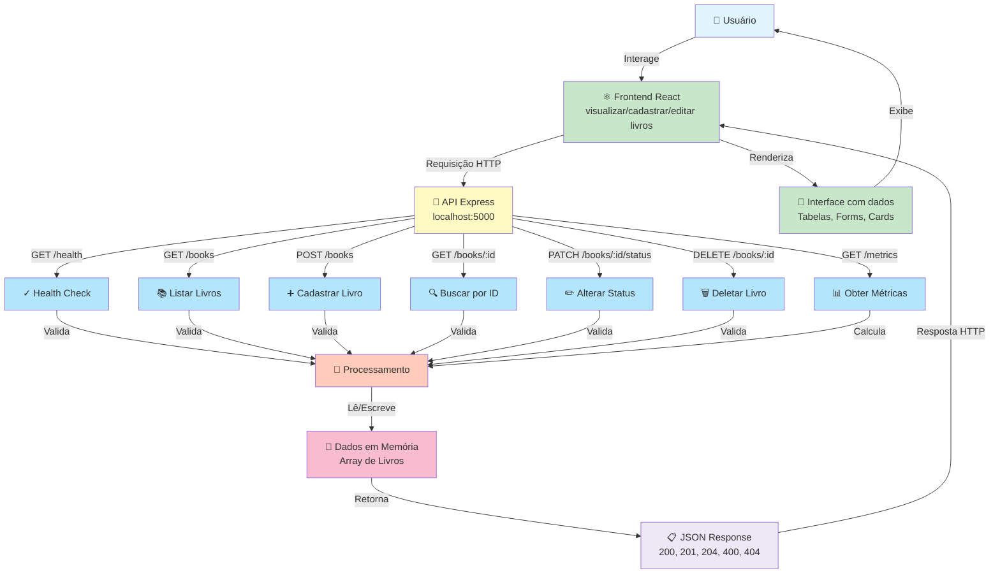

# 📊 Diagrama de Fluxo - BookShelf API

## Visão Geral

Este documento apresenta o fluxo completo da aplicação BookShelf, desde a interação do usuário com o frontend React até o armazenamento e recuperação de dados na memória.

---

## 🔄 Fluxo da Aplicação



---

## 📝 Descrição do Fluxo

### 1. **Usuário e Frontend** 👤 ⚛️
- Usuário interage com a interface React
- Frontend permite: visualizar, cadastrar, editar e deletar livros
- Interface responsiva com tabelas, formulários e cards

### 2. **Requisição para API** 🔄
- Frontend envia requisição HTTP para `http://localhost:5000`
- Tipos de requisição: GET, POST, PATCH, DELETE

### 3. **Rotas da API Express** 📍

| Rota | Método | Descrição |
|------|--------|-----------|
| `/health` | GET | Verifica se a API está funcionando |
| `/books` | GET | Lista todos os livros (com filtros) |
| `/books` | POST | Cadastra um novo livro |
| `/books/:id` | GET | Busca um livro específico |
| `/books/:id/status` | PATCH | Altera o status do livro |
| `/books/:id` | DELETE | Deleta um livro |
| `/metrics` | GET | Retorna estatísticas da biblioteca |

### 4. **Processamento** 🔐
- Validação de dados obrigatórios (title, author, category, status)
- Validação de valores permitidos (status: unread/reading/finished)
- Validação de valores permitidos (category: software/architecture/data/career)
- Tratamento de erros (400, 404)

### 5. **Dados em Memória** 💾
- Array JavaScript com objetos de livros
- Cada livro possui: id, title, author, category, status, rating, createdAt
- Dados persistem apenas durante a execução
- Reiniciando o servidor, volta aos dados iniciais

### 6. **Resposta JSON** 📋
- Status HTTP: 200 (OK), 201 (Created), 204 (No Content), 400 (Bad Request), 404 (Not Found)
- Resposta em formato JSON com os dados processados
- Retorna ao frontend para renderização

### 7. **Interface Renderizada** 🎨
- Frontend React recebe a resposta
- Renderiza os dados em componentes visuais
- Usuário visualiza as mudanças em tempo real

---

## 🔀 Fluxos de Casos de Uso

### Caso 1: Listar Livros
```
Usuário → Frontend → GET /books → API valida → Lê memória → JSON array → Frontend renderiza → Usuário vê tabela
```

### Caso 2: Cadastrar Livro
```
Usuário → Preenche form → Frontend → POST /books (title, author, category, status, rating) 
→ API valida campos → Gera novo ID → Escreve em memória → Retorna livro criado (201) 
→ Frontend renderiza → Usuário vê novo livro na lista
```

### Caso 3: Atualizar Status
```
Usuário → Clica em botão status → Frontend → PATCH /books/:id/status {status: "finished"} 
→ API valida livro existe → API valida novo status → Atualiza memória → Retorna livro atualizado (200) 
→ Frontend renderiza → Usuário vê status alterado
```

### Caso 4: Deletar Livro
```
Usuário → Clica em deletar → Frontend → DELETE /books/:id 
→ API valida livro existe → Remove de memória → Retorna 204 (sem conteúdo) 
→ Frontend remove da lista → Usuário vê livro desaparecido
```

### Caso 5: Consultar Métricas
```
Usuário → Clica em dashboard → Frontend → GET /metrics 
→ API calcula: totalBooks, booksByStatus, booksByCategory, averageRating 
→ Retorna JSON (200) → Frontend exibe gráficos/estatísticas → Usuário visualiza relatório
```

---

## 🏗️ Arquitetura

### Componentes

```
┌─────────────────────────────────────────┐
│        Frontend React                   │
│  - App.jsx                              │
│  - pages/                               │
│  - components/                          │
└────────────────┬────────────────────────┘
                 │ HTTP (Requisição/Resposta)
                 ▼
┌─────────────────────────────────────────┐
│        Backend Express                  │
│  - app.js (rotas)                       │
│  - server.js (porta 5000)               │
│  - openapi.yaml (documentação)          │
└────────────────┬────────────────────────┘
                 │ Leitura/Escrita
                 ▼
┌─────────────────────────────────────────┐
│      Dados em Memória (RAM)             │
│  - Array de Livros                      │
│  - nextBookId (contador)                │
└─────────────────────────────────────────┘
```

---

## ✅ Características

- ✅ **Sem banco de dados externo** - Dados armazenados em memória
- ✅ **Sem autenticação** - Acesso público à API
- ✅ **Sem serviços externos** - Tudo local
- ✅ **Dados temporários** - Reinicia ao executar servidor
- ✅ **7 rotas principais** - Health, Listar, Criar, Buscar, Atualizar, Deletar, Métricas
- ✅ **Validações robustas** - Campo obrigatório, valores permitidos
- ✅ **Respostas padronizadas** - Erros consistentes em JSON
- ✅ **CORS habilitado** - Frontend e Backend em portas diferentes

---

## 📚 Status Possíveis

- **unread** - Livro não lido
- **reading** - Livro sendo lido atualmente
- **finished** - Livro finalizado

---

## 🏷️ Categorias Possíveis

- **software** - Desenvolvimento de Software
- **architecture** - Arquitetura
- **data** - Dados
- **career** - Carreira

---

**Última atualização:** Maio de 2026
