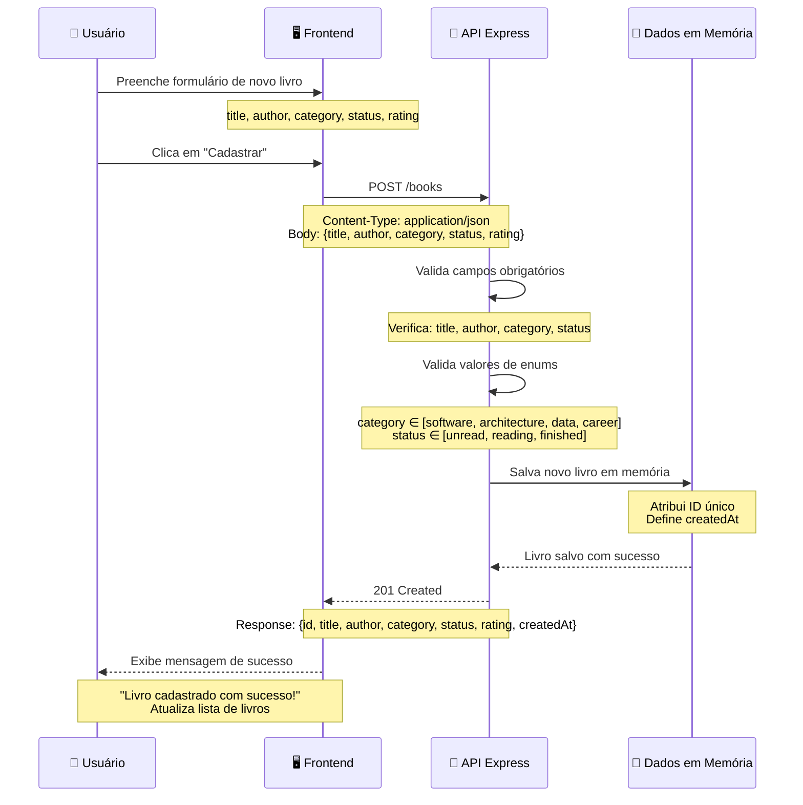
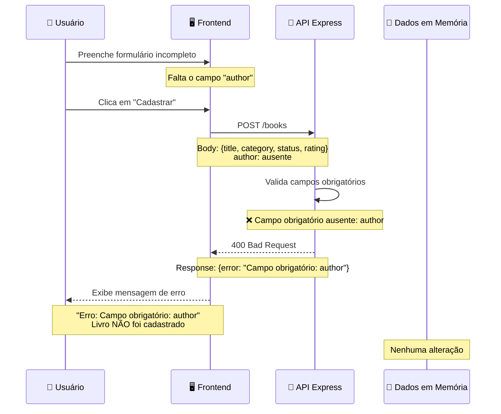
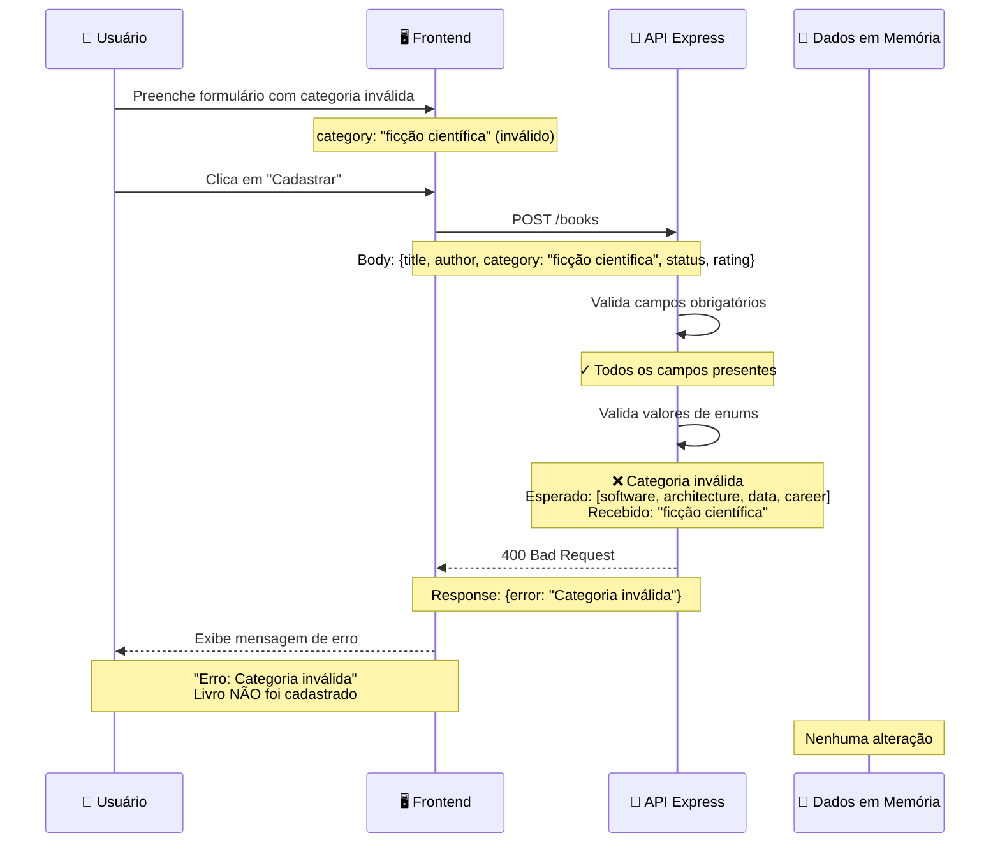

# Diagrama de Sequência - Cadastro de Livro

## Visão Geral

Este diagrama ilustra o fluxo completo de cadastro de um livro na BookShelf API, incluindo cenários de sucesso e erro.

---

## Diagrama - Fluxo de Sucesso



---

## Diagrama - Fluxo de Erro (Campo Obrigatório Ausente)



---

## Diagrama - Fluxo de Erro (Valor de Enum Inválido)



---

## Fluxo Detalhado - Sucesso

### 1. **Entrada do Usuário**
- Usuário preenche o formulário com:
  - **title** (obrigatório): "Clean Code"
  - **author** (obrigatório): "Robert C. Martin"
  - **category** (obrigatório): "software"
  - **status** (obrigatório): "unread"
  - **rating** (opcional): 5

### 2. **Envio para API**
- Frontend envia requisição POST para `/books`
- Headers: `Content-Type: application/json`
- Body contém todos os dados do formulário

### 3. **Validação na API**
- Verifica se todos os campos obrigatórios estão presentes
- Valida se os valores de `category` e `status` são válidos
- Se houver erro, retorna 400 Bad Request

### 4. **Salvamento em Memória**
- API gera um ID único para o livro
- Define `createdAt` com timestamp atual
- Armazena o livro na estrutura de dados em memória

### 5. **Resposta de Sucesso**
- API retorna status 201 Created
- Response contém o livro completo com ID e timestamp
- Frontend exibe mensagem de sucesso
- Lista de livros é atualizada na interface

---

## Fluxo Detalhado - Erro

### Cenário 1: Campo Obrigatório Ausente

1. **Validação Falha**: Campo `author` está vazio ou ausente
2. **Resposta**: 400 Bad Request com mensagem `"Campo obrigatório: author"`
3. **Resultado**: Livro NÃO é salvo, usuário recebe feedback de erro

### Cenário 2: Valor de Enum Inválido

1. **Validação Falha**: `category` não está em `[software, architecture, data, career]`
2. **Resposta**: 400 Bad Request com mensagem `"Categoria inválida"`
3. **Resultado**: Livro NÃO é salvo, usuário recebe feedback de erro

---

## Estrutura de Dados

### Request (POST /books)

```json
{
  "title": "Clean Code",
  "author": "Robert C. Martin",
  "category": "software",
  "status": "unread",
  "rating": 5
}
```

### Response 201 (Sucesso)

```json
{
  "id": 4,
  "title": "Clean Code",
  "author": "Robert C. Martin",
  "category": "software",
  "status": "unread",
  "rating": 5,
  "createdAt": "2026-05-19T14:30:00.000Z"
}
```

### Response 400 (Erro)

```json
{
  "error": "Campo obrigatório: author"
}
```

---

## Validações Implementadas

| Validação | Tipo | Valores Válidos |
|-----------|------|-----------------|
| **title** | Obrigatório | String não vazia |
| **author** | Obrigatório | String não vazia |
| **category** | Obrigatório | software, architecture, data, career |
| **status** | Obrigatório | unread, reading, finished |
| **rating** | Opcional | 0 a 5 (padrão: 0) |

---

## Participantes

### 👤 Usuário
- Interage com a interface
- Preenche formulário
- Recebe feedback de sucesso ou erro

### 🖥️ Frontend
- Coleta dados do formulário
- Envia requisição HTTP para API
- Exibe respostas ao usuário
- Atualiza interface conforme necessário

### 🔧 API Express
- Recebe requisição POST
- Valida dados de entrada
- Processa lógica de negócio
- Retorna resposta apropriada

### 💾 Dados em Memória
- Armazena livros cadastrados
- Mantém estado durante execução
- Reinicia ao reiniciar servidor

---

## Notas Importantes

- ✅ Dados são armazenados em memória (não persistem após reinicialização)
- ✅ Sem autenticação ou autorização
- ✅ Sem banco de dados externo
- ✅ Sem serviços externos
- ✅ Validações ocorrem na API antes de salvar
- ✅ Cada livro recebe um ID único e timestamp de criação
- ✅ Rating é opcional e padrão é 0

---

**Última atualização:** Maio de 2026
