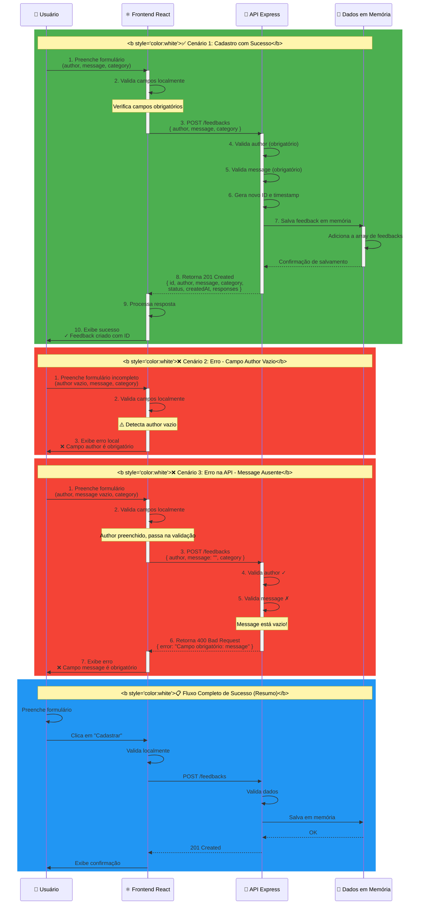

# 🔄 Diagrama de Sequência - FeedbackHub CI

## Visão Geral

Este documento apresenta o diagrama de sequência da aplicação FeedbackHub CI, representando as interações entre usuário, frontend React, API Express e armazenamento de dados durante o processo de cadastro de feedback.

---

## 📊 Diagrama de Sequência - Cadastro de Feedback



---

## 📝 Detalhamento dos Cenários

### ✅ Cenário 1: Cadastro com Sucesso

**Pré-requisitos:**
- Usuário preenche todos os campos obrigatórios
- Campos válidos: author e message não vazios

**Fluxo:**
1. Usuário preenche o formulário com dados válidos
2. Frontend valida os campos localmente
3. Frontend envia POST `/feedbacks` para a API
4. API valida campos `author` e `message`
5. API gera novo ID e timestamp
6. Feedback é salvo em memória
7. API retorna `201 Created` com os dados do feedback
8. Frontend renderiza mensagem de sucesso
9. Usuário visualiza confirmação: "Feedback criado com ID #123"

**Resposta de Sucesso (201):**
```json
{
  "id": 123,
  "author": "João Silva",
  "message": "Ótima experiência com o sistema!",
  "category": "sugestão",
  "status": "novo",
  "createdAt": "2026-05-19T15:30:00.000Z",
  "responses": []
}
```

---

### ❌ Cenário 2: Erro Local - Campo Author Vazio

**Pré-requisitos:**
- Usuário tenta cadastrar sem preencher o campo `author`

**Fluxo:**
1. Usuário deixa campo `author` vazio
2. Frontend valida localmente
3. Frontend detecta campo obrigatório ausente
4. Exibição imediata de erro sem enviar para a API
5. Usuário recebe mensagem: "Campo author é obrigatório"

**Vantagem:** Reduz tráfego de rede e resposta mais rápida

---

### ❌ Cenário 3: Erro na API - Campo Message Vazio

**Pré-requisitos:**
- Frontend deixa passar um campo vazio por falha na validação
- Ou usuário manipula a requisição manualmente

**Fluxo:**
1. Usuário preenche `author` mas deixa `message` vazio
2. Frontend passa pela validação (simulando falha)
3. Requisição é enviada para a API
4. API valida campo `author` ✓
5. API valida campo `message` e encontra valor vazio ✗
6. API retorna `400 Bad Request` com mensagem de erro
7. Frontend recebe erro e exibe para o usuário
8. Usuário visualiza: "Campo message é obrigatório"

**Resposta de Erro (400):**
```json
{
  "error": "Campo obrigatório: message"
}
```

---

## 📋 Campos Obrigatórios

| Campo | Tipo | Descrição | Validação |
|-------|------|-----------|-----------|
| `author` | String | Nome do autor do feedback | Não pode estar vazio |
| `message` | String | Conteúdo do feedback | Não pode estar vazio |
| `category` | String | Categoria do feedback | Deve ser válida |

---

## 🔄 Endpoints da API

### POST /feedbacks - Cadastrar Feedback

**Request:**
```
POST /feedbacks HTTP/1.1
Content-Type: application/json

{
  "author": "João Silva",
  "message": "Feedback sobre a aplicação",
  "category": "sugestão"
}
```

**Success Response (201 Created):**
```
HTTP/1.1 201 Created
Content-Type: application/json

{
  "id": 123,
  "author": "João Silva",
  "message": "Feedback sobre a aplicação",
  "category": "sugestão",
  "status": "novo",
  "createdAt": "2026-05-19T15:30:00.000Z",
  "responses": []
}
```

**Error Response (400 Bad Request):**
```
HTTP/1.1 400 Bad Request
Content-Type: application/json

{
  "error": "Campo obrigatório: message"
}
```

---

## 💾 Estrutura de Dados em Memória

```javascript
// Antes de cadastrar
const feedbacks = [
  { id: 1, author: "Maria", message: "...", ... },
  { id: 2, author: "Pedro", message: "...", ... }
];

// Após cadastrar novo feedback
const feedbacks = [
  { id: 1, author: "Maria", message: "...", ... },
  { id: 2, author: "Pedro", message: "...", ... },
  { 
    id: 3, 
    author: "João Silva", 
    message: "Ótima experiência!", 
    category: "sugestão",
    status: "novo",
    createdAt: "2026-05-19T15:30:00.000Z",
    responses: []
  }
];
```

---

## ✨ Validações

### No Frontend (Preventivo)
- ✅ Campo `author` não vazio
- ✅ Campo `message` não vazio
- ✅ Campo `category` não vazio
- ✅ Feedback visual imediato

### Na API (Defensivo)
- ✅ Valida `author` (obrigatório, string não vazia)
- ✅ Valida `message` (obrigatório, string não vazia)
- ✅ Valida `category` (deve estar na lista de categorias permitidas)
- ✅ Retorna erro `400 Bad Request` se falhar

---

## 🎯 Codes HTTP

| Código | Significado | Quando |
|--------|-------------|--------|
| `201` | Created | Feedback criado com sucesso |
| `400` | Bad Request | Campo obrigatório ausente ou inválido |
| `500` | Internal Server Error | Erro no servidor |

---

## 📊 Resumo do Fluxo

```
┌─────────────┐
│   Usuário   │ Preenche formulário
└──────┬──────┘
       │
       ▼
┌──────────────────┐
│ Frontend React   │ Valida localmente
└──────┬───────────┘
       │
       ├─── Erro local? ──► Exibe erro para usuário
       │
       ▼
┌──────────────────┐
│  API Express     │ Valida novamente
└──────┬───────────┘
       │
       ├─── Erro? ──► Retorna 400
       │
       ▼
┌──────────────────┐
│ Dados Memória    │ Salva feedback
└──────┬───────────┘
       │
       ▼
     201 OK ──► Usuário vê confirmação
```

---

## ✅ Características

- ✅ Sem banco de dados externo
- ✅ Sem autenticação
- ✅ Sem serviços externos
- ✅ Validação dupla (frontend + API)
- ✅ Dados salvos em memória
- ✅ Respostas HTTP padrão
- ✅ Tratamento completo de erros

---

**Última atualização:** Maio de 2026
