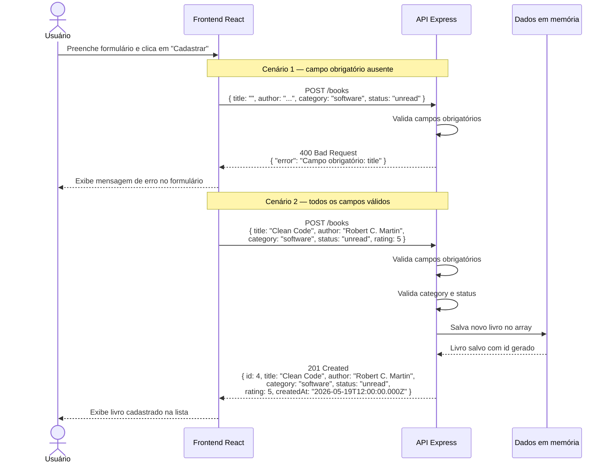

# Diagrama de Sequência — Cadastro de Livro

```mermaid
sequenceDiagram
    actor U as Usuário
    participant FE as Frontend React
    participant API as API Express
    participant MEM as Dados em memória

    U->>FE: Preenche formulário e clica em "Cadastrar"

    %% ─── Cenário de erro: campo obrigatório ausente ───
    Note over FE,API: Cenário 1 — campo obrigatório ausente

    FE->>API: POST /books<br/>{ title: "", author: "...", category: "software", status: "unread" }
    API->>API: Valida campos obrigatórios
    API-->>FE: 400 Bad Request<br/>{ "error": "Campo obrigatório: title" }
    FE-->>U: Exibe mensagem de erro no formulário

    %% ─── Cenário de sucesso: livro cadastrado ───
    Note over FE,API: Cenário 2 — todos os campos válidos

    FE->>API: POST /books<br/>{ title: "Clean Code", author: "Robert C. Martin",<br/>category: "software", status: "unread", rating: 5 }
    API->>API: Valida campos obrigatórios
    API->>API: Valida category e status
    API->>MEM: Salva novo livro no array
    MEM-->>API: Livro salvo com id gerado
    API-->>FE: 201 Created<br/>{ id: 4, title: "Clean Code", author: "Robert C. Martin",<br/>category: "software", status: "unread",<br/>rating: 5, createdAt: "2026-05-19T12:00:00.000Z" }
    FE-->>U: Exibe livro cadastrado na lista
```
