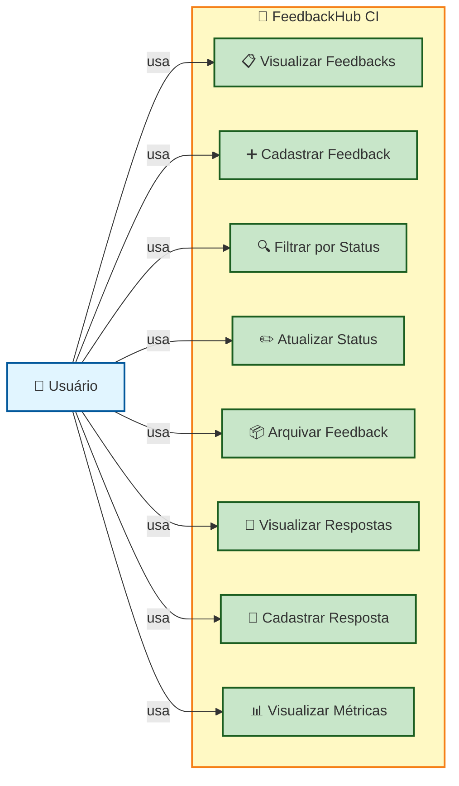

# 📊 Diagrama de Caso de Uso - FeedbackHub CI

## Visão Geral

Este documento apresenta o diagrama de casos de uso da aplicação FeedbackHub CI, representando as funcionalidades disponíveis para o usuário interagir com o sistema.

---

## 🎭 Diagrama de Caso de Uso



---

## 📝 Descrição dos Casos de Uso

### 1. 📋 Visualizar Feedbacks
**Descrição:** O usuário pode visualizar uma lista com todos os feedbacks cadastrados no sistema.

**Fluxo:**
- Usuário acessa a tela principal
- Sistema exibe lista de feedbacks com informações (título, data, status, autor)
- Usuário pode visualizar detalhes de cada feedback

---

### 2. ➕ Cadastrar Feedback
**Descrição:** O usuário pode criar um novo feedback no sistema.

**Fluxo:**
- Usuário clica em "Novo Feedback"
- Sistema exibe formulário para preenchimento
- Usuário insere: título, descrição, categoria
- Usuário confirma criação
- Sistema armazena o novo feedback

---

### 3. 🔍 Filtrar por Status
**Descrição:** O usuário pode filtrar feedbacks por seu status.

**Fluxo:**
- Usuário seleciona um filtro de status
- Sistema exibe apenas feedbacks com o status selecionado
- Usuário pode remover filtro para visualizar todos novamente

**Status Possíveis:**
- Novo
- Em revisão
- Aprovado
- Rejeitado
- Arquivado

---

### 4. ✏️ Atualizar Status
**Descrição:** O usuário pode alterar o status de um feedback existente.

**Fluxo:**
- Usuário seleciona um feedback
- Usuário escolhe um novo status
- Sistema atualiza o feedback
- Usuário recebe confirmação de sucesso

---

### 5. 📦 Arquivar Feedback
**Descrição:** O usuário pode arquivar um feedback para removê-lo da visualização principal.

**Fluxo:**
- Usuário seleciona um feedback
- Usuário clica em "Arquivar"
- Sistema move o feedback para a seção de arquivados
- Feedback ainda pode ser recuperado posteriormente

---

### 6. 💬 Visualizar Respostas
**Descrição:** O usuário pode visualizar as respostas (comentários) associadas a um feedback.

**Fluxo:**
- Usuário seleciona um feedback
- Sistema exibe todas as respostas vinculadas
- Cada resposta mostra autor, data e conteúdo
- Usuário pode ler discussões completas

---

### 7. 💭 Cadastrar Resposta
**Descrição:** O usuário pode adicionar uma resposta (comentário) a um feedback existente.

**Fluxo:**
- Usuário seleciona um feedback
- Usuário clica em "Adicionar Resposta"
- Sistema exibe campo de texto
- Usuário digita a resposta
- Usuário confirma envio
- Sistema armazena a resposta vinculada ao feedback

---

### 8. 📊 Visualizar Métricas
**Descrição:** O usuário pode visualizar estatísticas gerais sobre feedbacks.

**Métricas Disponíveis:**
- Total de feedbacks cadastrados
- Quantidade por status
- Quantidade por categoria
- Taxa de aprovação
- Tempo médio de resolução
- Feedbacks mais recentes
- Feedbacks com mais respostas

---

## 🏗️ Relacionamentos entre Casos de Uso

```
Usuário
  ├── Visualizar Feedbacks
  │   └── Pode levar a: Filtrar, Atualizar Status, Visualizar Respostas
  ├── Cadastrar Feedback
  │   └── Cria novo item para visualizar
  ├── Filtrar por Status
  │   └── Refina lista de Visualizar Feedbacks
  ├── Atualizar Status
  │   └── Modifica feedback existente
  ├── Arquivar Feedback
  │   └── Remove de visualização principal
  ├── Visualizar Respostas
  │   └── Detalha feedback selecionado
  ├── Cadastrar Resposta
  │   └── Adiciona comentário a feedback
  └── Visualizar Métricas
      └── Dashboard de estatísticas
```

---

## ✨ Atores

| Ator | Descrição |
|------|-----------|
| **Usuário** | Pessoa que interage com o sistema para gerenciar feedbacks e respostas |

---

## 🎯 Recursos do Sistema

| Recurso | Descrição |
|---------|-----------|
| **Feedback** | Item principal contendo título, descrição, status, data e autor |
| **Resposta** | Comentário vinculado a um feedback |
| **Status** | Estado atual do feedback (Novo, Em revisão, Aprovado, Rejeitado, Arquivado) |
| **Categoria** | Classificação do feedback para organização |
| **Métricas** | Estatísticas gerais do sistema |

---

## 📋 Resumo

A aplicação FeedbackHub CI oferece ao usuário 8 casos de uso principais:

1. ✅ Visualização de feedbacks
2. ✅ Criação de feedbacks
3. ✅ Filtros por status
4. ✅ Atualização de status
5. ✅ Arquivamento de feedbacks
6. ✅ Visualização de respostas
7. ✅ Criação de respostas
8. ✅ Consulta de métricas

Todos os casos de uso são acessíveis de forma direta e intuitiva pela interface da aplicação.

---

**Última atualização:** Maio de 2026
