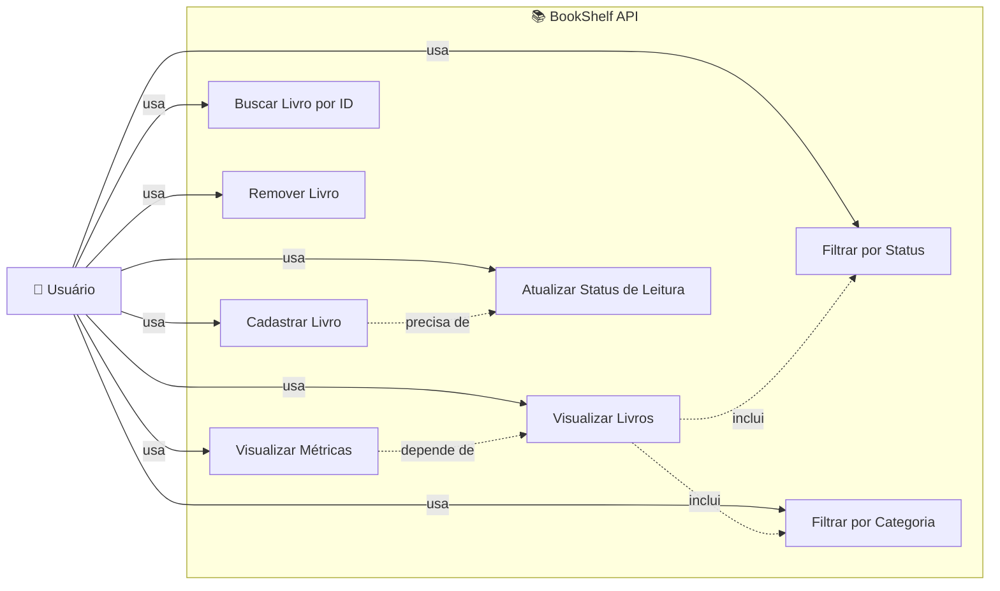

# Diagrama de Caso de Uso - BookShelf API

## Visão Geral

Este diagrama representa os casos de uso do sistema BookShelf API, mostrando as interações entre o usuário e as funcionalidades disponíveis na aplicação.

---

## Diagrama

---

## Descrição dos Casos de Uso

### 1. **Visualizar Livros**
- O usuário pode visualizar a lista completa de livros cadastrados na estante
- Exibe informações como título, autor, categoria, status e avaliação

### 2. **Cadastrar Livro**
- O usuário pode adicionar um novo livro à estante
- Requer informações obrigatórias: título, autor, categoria e status inicial
- Opcionalmente pode atribuir uma avaliação

### 3. **Buscar Livro por ID**
- O usuário pode procurar um livro específico usando seu identificador único
- Retorna os detalhes completos do livro encontrado

### 4. **Atualizar Status de Leitura**
- O usuário pode alterar o status de um livro entre: não lido, lendo ou finalizado
- Permite rastrear o progresso de leitura

### 5. **Remover Livro**
- O usuário pode deletar um livro da estante
- Remove permanentemente o livro do sistema

### 6. **Filtrar por Status**
- O usuário pode filtrar livros por seu status de leitura
- Facilita a visualização de livros em categorias específicas

### 7. **Filtrar por Categoria**
- O usuário pode filtrar livros por categoria (software, arquitetura, dados, carreira)
- Ajuda na organização e busca por tópicos de interesse

### 8. **Visualizar Métricas**
- O usuário pode consultar estatísticas sobre sua estante
- Inclui: total de livros, distribuição por status, distribuição por categoria e avaliação média

---

## Relacionamentos

### Inclusão (-.->)
- **Visualizar Livros** inclui **Filtrar por Status** e **Filtrar por Categoria**
  - Os filtros são parte integral da visualização de livros
  
- **Visualizar Métricas** depende de **Visualizar Livros**
  - As métricas são calculadas com base nos livros cadastrados

### Extensão (-.->)
- **Cadastrar Livro** precisa de **Atualizar Status**
  - Ao criar um livro, é necessário definir seu status inicial

---

## Atores

### 👤 Usuário
- Ator principal do sistema
- Interage com todas as funcionalidades da BookShelf API
- Responsável por gerenciar sua coleção de livros

---

## Sistema

### 📚 BookShelf API
- Sistema de gerenciamento de estante de livros
- Fornece todas as funcionalidades de CRUD (Create, Read, Update, Delete)
- Oferece recursos de filtro e análise de dados

---

## Fluxo de Interação Típico

1. **Usuário acessa a API** → Visualiza lista de livros
2. **Usuário filtra livros** → Por status ou categoria
3. **Usuário busca um livro específico** → Por ID
4. **Usuário cadastra novo livro** → Define título, autor, categoria e status
5. **Usuário atualiza status** → Marca como lendo ou finalizado
6. **Usuário consulta métricas** → Verifica estatísticas da estante
7. **Usuário remove livro** → Deleta da estante se necessário

---

## Notas Técnicas

- Todos os casos de uso são acessíveis via endpoints REST
- Não há autenticação ou autorização no escopo atual
- Os dados são armazenados em memória durante a execução
- Cada operação retorna respostas estruturadas em JSON
- Validações são aplicadas em todos os casos de uso

---

**Última atualização:** Maio de 2026
